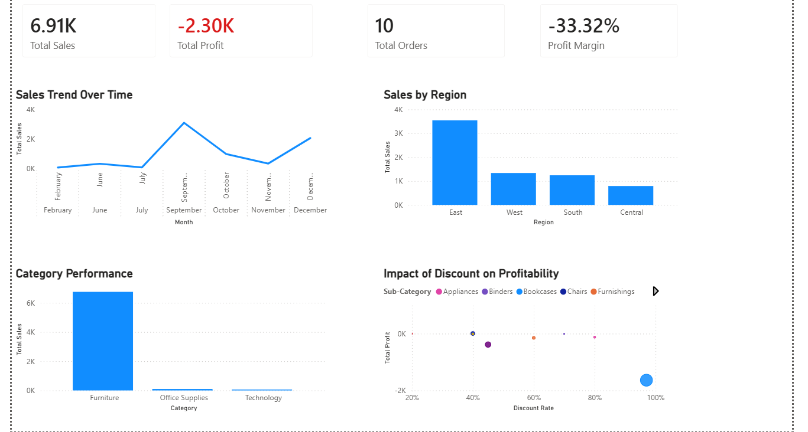

**Retail Sales Analysis – Power BI Executive Dashboard**

**Project Overview**

This project presents an interactive Retail Sales Executive Dashboard built in Power BI.
The goal was to analyze sales performance, profitability trends, and the impact of discounting on business performance across regions and product categories.
The dashboard is designed for executive-level decision-making, highlighting key KPIs and actionable insights in a clean, business-focused layout.

**Business Objectives**
 
Analyze overall sales and profit performance
Identify high- and low-performing regions
Evaluate monthly sales trends
Understand how discounting impacts profitability
Provide executive-ready insights for strategic decisions

 **Tools & Technologies**
 
Power BI Desktop

DAX (Data Analysis Expressions)

Data Modeling & Relationships

GitHub (Project Documentation & Version Control)

**Key Metrics Created (DAX Measures)**
 
1. Total Sales
2. Total Profit
3. Total Orders
4. Profit Margin (%)
5. Total Quantity

Custom measures were created using DAX to ensure accurate aggregation and executive-level reporting.

 **Dashboard Pages**
 
**Executive Summary**

High-level KPIs:

Total Sales

Total Profit

Total Orders

Profit Margin

Visuals included:

1. Sales Trend Over Time (Line Chart)
2. Sales by Region (Column Chart)
3. Category Performance
4. Discount vs Profitability Scatter Analysis

 **Discount Impact Analysis**

A scatter chart was built to show:

X-Axis → Discount

Y-Axis → Profit

Size → Sales

Legend → Sub-Category

This visualization highlights the relationship between discount levels and profitability, helping identify areas where aggressive discounting may be hurting margins.

 **Key Insights**
 
Higher discount levels tend to reduce profitability in several sub-categories.
The East region shows stronger sales performance compared to other regions.
Some categories generate revenue but operate at negative margins.
Profit margin requires strategic discount optimization.

 **Data Model**
 
A proper star schema model was implemented:

Fact Table: Sales
Dimension Table: Date
One-to-Many relationships
Cleaned and structured for accurate time intelligence

 **How to Use**
 
1. Download the .pbix file from this repository.
2. Open in Power BI Desktop.
3. Interact with filters and visuals to explore performance drivers.

 **What This Project Demonstrates**
 
1. Business intelligence thinking
2. Data modeling best practices
3. DAX proficiency
4. Executive dashboard design
5. Data storytelling
6. GitHub documentation discipline

 **About Me**
 
Aspiring Data Analyst passionate about turning raw data into strategic insights.
Skilled in Power BI, Excel, SQL, and business-focused analytics.

Open to data analyst opportunities.

## Dashboard Preview

